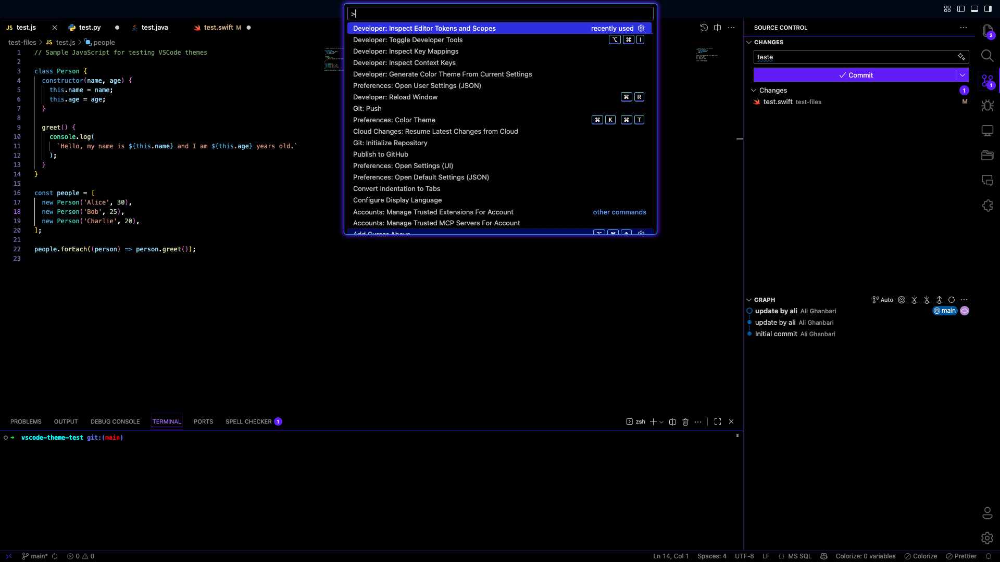
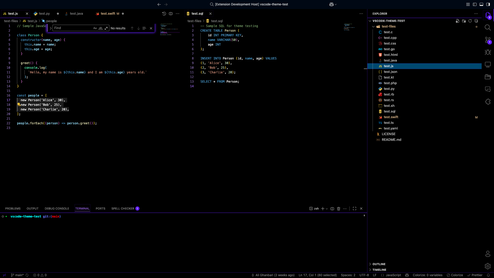

# Darker Neon Theme for Visual Studio Code

A modern, vibrant dark theme for VS Code, designed for those who love dark themes with small colors details. Darker Neon brings a unique blend of color and contrast to your editor, hope that you like it 😀!

I made this theme with a lot of love ❤️.

---

## Features

- **True Dark Backgrounds:** Deep black and subtle surfaces for minimal eye strain.
- **Neon Accents:** Carefully selected neon purples, blues, and pinks for highlights and UI elements.
- **Readable Typography:** Crisp, high-contrast text for code and UI.
- **Semantic Highlighting:** Enhanced support for semantic tokens for richer syntax coloring.
- **Consistent UI:** Harmonized colors across panels, tabs, status bar, and more.
- **Accessible Borders:** Distinct borders for active/inactive elements, improving navigation.

---

## Screenshots

---

## Installation

### Visual Studio Code Marketplace

1. Open **Extensions** sidebar (`Ctrl+Shift+X`).
2. Search for `Darker Neon`.
3. Click **Install**.

## Usage

1. Open the Command Palette (`Ctrl+K Ctrl+T`).
2. Select **Color Theme**.
3. Choose **Darker Neon**.

---

## Color Palette

Darker Neon uses a carefully curated palette:

- **Background:** `#000000`
- **Surface:** `#030c1b`, `#000815`, `#3c3c3c99`, `#00060f`
- **Accent:** `#6800ff` (Purple), `#fb5474` (Pink), `#009fff` (Blue), `#adff00` (Green), `#ffd100` (Yellow), `#ad1d00` (Red), `#66ffb4` (Teal)
- **Text:** `#cccccc`, `#dedddd`, `#cdcdcd`, `#eaeaea`

For full details, see the [theme file](themes/Darker-color-theme.json).

---

## Changelog

See [CHANGELOG.md](CHANGELOG.md) for release notes and updates.

---

## Contributing

Contributions, suggestions, and issues are welcome! Please open an issue or pull request on [GitHub](https://github.com/yourusername/your-repo-name).

---

## Author

**Kevin Rossetti Fernandes**  
[GitHub Profile](https://github.com/kevinrf100)

---

## License

This theme is released under the [MIT License](LICENSE).

---

**Enjoy coding with Darker Neon! If you like it, please star the repo and share your feedback.**
